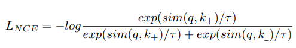

## Contrastive learning
### Possible augmentations/tasks:  [[1]](#1) (sec 2)
* color distortions
* geometric transformations
* jigsaw puzzle

### How to choose the right pretext task? [[1]](#1) (sec 2.3)
This survey claims that there is a work #26 where authors showed how some distortions 
were suitable, while some weren't. However, that's not a theoretical analysis.

### How to collect negative samples

4 strategies [[1]](#1) (sec 3)
* end-to-end learning [[1]](#1) (sec 3.1)
    * Used in SimCLR, CPC, others
    * drawback: number of negative samples limited by the batch size
* memory bank [[1]](#1) (sec 3.2)
    * aim: accumulate a large number of feature represntations of negative samples
    * used in PIRL, Wu et al
    * drawback: computationally and memory exhaustive
* momentum encoder [[1]](#1) (sec 3.3)
* clustering [[1]](#1) (sec 3.4)

? **Стоит перечитать [[1]](#1) (sec 3), потому что пока все кроме end-to-end не 
очень понятно** 

### Encoder architercture  [[1]](#1) (sec 4)
People usually use ResNet variatnts, mostyly ResNet50.

Study #17 (Misra et al.) investigated how good are fetures of different levels of ResNet50
and found out the later layer the better

### Losses  [[1]](#1) (sec 5)
__Similarity functions:__
* cosine similarity

  
__Losses:__
* NCE (Noise Contrastive Estimation) #38
  
  q - the original sample  
  k+ - positive sample  
  k- - negative sample  
  tau - hyperparameter called temperature coefficient   
* InfoNCE used when more negative samples
  
  ki - negative samples

 ### Optimizers [[1]](#1) (sec 5)
Usually SGD, Adam.  

In case of large batch size, SGD-based optimizers with a linear lr scaling become unstable. 
**why they become unstable?**
To stabilize training some use 
* LARS (Layer-weise Adaptive Rage Scaling)
* cosine learning rate

 ### Downstream tasks [[1]](#1) (sec 6)
Classification, localization, detection, segmentation, ...

### Sanity checks on repersentations learned
1. Visualizing kernels & feture maps [[1]](#1) (sec 6.1)  
Use attention maps like Gidaris et al. (paper on predicting rotations)
2. Nearest neighbours retrieval [[1]](#1) (sec 6.2)  
Samples from the same class should be close in the latent space.  
   Use nearest neighbour approach and evaluate top-K retrieval for a given image.
   
### Further research  [[1]](#1) (sec 9)
1. lack of theoretical foundation
   Arora et al. #74: show that architecture & sampling techinques influence the performance  
   Tsai et al. #83:  ознакомиться  
   

      
provide information-theortical framework to understand what properties benefit self-sup learning

   They demonstrate that self-supervised learned representations can extract task-relevant information (with a potential loss) and discard task-irrelevant information (with a fixed gap).
   Ultimately, it propels the methods towards being highly dependent on the pretext task chosen during training. This affirms the need for more theoretical analysis on different modules in a contrastive pipeline.
   

2. how to choose data augmentations and pretext tasks
   PIRL #17 suggests methods indifferent to selected pretext task  
   SimCLR, MoCo, Tial et al. #19: pretext tasks & augmentation are important  
   ?  подумать над задачей минимизирующей MI или что-то такое находимых фич 
   
3. how to choose proper negative sampling  
   Easy negatives (low similarity of original and negative) don't contribute much to the contrastive loss.
   => Can't converge quickly.  
   Solutions:
      * larger batch size
      * large memory bank
      * Kalantidis et al. #84 proposed some hard negative mixing strategy, but it has many hyperparameters to tune 
  
   
4. dataset biases

### Benchmarks
Different. Some examples
  

## References
<a id="1">[1]</a> 
Jaiswal et al. 2020
A Survey on Contrastive Self-supervised Learning
[arxiv](https://arxiv.org/abs/2011.00362) [pdf](papers/a_survey_on_contrastive_selfsupervised_learning.pdf)
 

