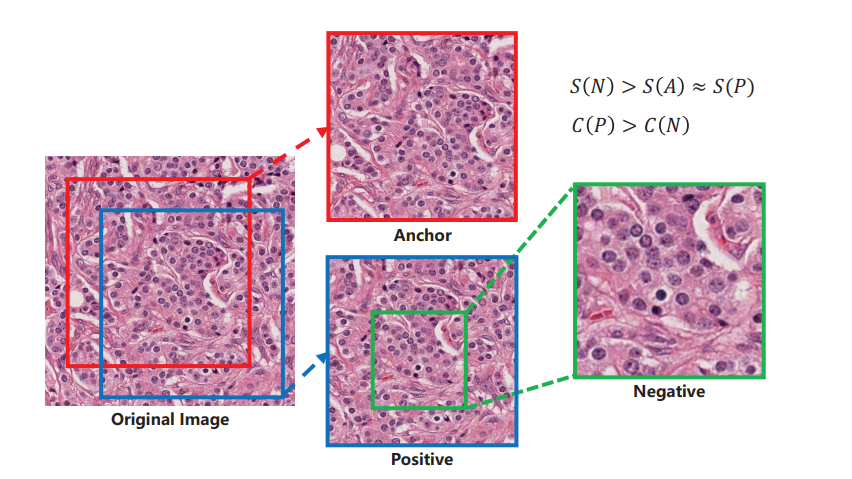

## SSL for Semantic Segmentation
### Contrastive Learning for Label-Efficient Semantic Segmentation
Zhao et al.

__Note:__ they use SSL pretraining using masks (i.e. labels)

How the use SSL:
* Fully-supervised mode  
Algo:
    1. take images & masks
    2. train UNet-like NN in SSL manner (with SSL loss, using masks)
    3. replace projection head (top layer) with softmax
    4. tune for segmentation task using BCE
    
* Semi-supervised mode  
Algo:
    1. train a model in fully-supervised mode with labelled data
    2. use this model to create labels for the unlabelled data
    3. train a model in fully-supervised mode with labelled a& pseudo-labelled data
    
Pixel-wise label-based contrastive loss (their SSL loss):
Image I, distorted version I^, |I|=N  
Mask Y={yi}, yi \in 1..C, |I=c| = Nc  
F, F^ - representations of I, I^  
tau - temperature parameter
  

Note: they computer SSL loss separately for each image. 
They tried to to computer per-batch, but that worsened the performance.

Note: It is crucial to train the entire network in the fine-tuning stage,
as there is no interaction between pixels from different images during contrastive pretraining. 
While contrastive pretraining encourages pixels within an image to cluster according to their class labels, softmax fine-tuning rearranges
these clusters so that they fall on the correct side of the appropriate decision boundary.

### Self-supervised learning for segmentation
A. Dhere, J. Sivaswamy

Downstream task: segment kidneys

Method: use SSL to pretrain the encoder, that is later used in segmentation model  
Segmentation model is shares the encoder with a autoencoder, trained simultaneously.

Pretext task: split all CT scan images of kidneys into left and right halves 
-> given 2 halves predict if they are from the same side

SSL Loss: 
  
y - label: y= \mathbb{1}_{a & b from the same side}

### Medical Image Segmentation via Unsupervised Convolutional Neural Network 
Chen, Frey

 сложный лосс, пока нафиг 

### Self-supervision with Superpixels: Training Few-shot Medical Image Segmentation without Annotation
Ouyang et al.

They use superpixels in pretext task, but their tasks are totally different 
(few-shot learning tasks, with queries & supports)

### Self-Supervised Depth Learning Improves Semantic Segmentation
Irrelevant: pretext task specific for videos - depth prediction

### Self-Supervised Feature Learning for Semantic Segmentation of Overhead Imagery
Pretext task: inpainting  
How they use: pretrain Unet-like NN on pretext, the adapt by removing top layer 
and tune for segmentation  
Specialty: they train a special coach NN in parallel with the main NN.
The coach NN learns to generate difficult occluding masks (difficult for the main NN)

### Instance-aware Self-supervised Learning for Nuclei Segmentation
Xie et al.

Downstream task: segmenting nuclei  
Difficulty: images of different scale => nuclei of different sizes & differen count of nuclei in an image  
Notation: A (anchor), P (positive sample), N (negative sample)  
For sampling technique see picture  
  
Note: S(I) - size of nuclei in img I, C(I) - count of nuclei in img I  
2 pretext tasks:  
Task #1: triplet loss learning of A, P, N  
This tasks addresses primarily different nuclei sizes problem  
Task #2: Loss(P,N) = max(0, f(N)-f(P)+m), where f-NN, m-margin  
This task addresses different nuclei count problem (count in N should be less than in P by a margin m)  

### Fine-Grained Segmentation Networks: Self-Supervised Segmentation for Improved Long-Term Visual Localization
Larsson et al.

They use k-means clustering, but they have reference images and target images 
(with different view angle, different season of the year etc.)

### SeSe-Net: Self-Supervised deep learning for segmentation
Zeng et al.

Используют обучение с учителем (есть сетка основная и сетка учитель, оценивающая основную)  
 Пока не стала вчитываться, но можно будет перечитать 

