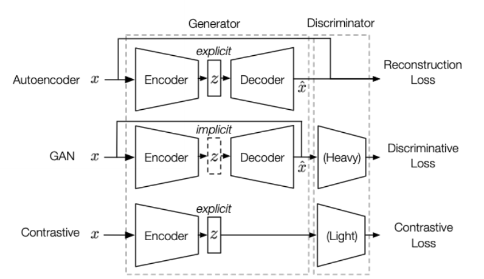

### Types of self-supervised models
1. Generative models
    * AE (autoencoders)  [[1]](#1) (sec 3.3): reconstruct (part of) inputs from (corrupted) inputs
        * AEs
        * Denoising AEs
        * Variational AEs
    * Flow-based models  [[1]](#1) (sec 3.2): estimate high-dimensional densities p(x) from data
    * AR (auto-regressive) models  [[1]](#1) (sec 3.1): model images pixel by pixel, examples
        * PixelRNN
        * PixelCNN
2. Contrastive models (i.e. discriminative models)
    * Context-instance contrast == global-local contrast  [[1]](#1) (sec 4.1): focus on modeling the belonging relationship between local feature of a sample and its global context representation
        * PRP (Predict Relative Position): learn relative postiions between components
            * predict relative postitions of 2 patches from a sample
            * recover positions of shuffled segments of the image (sove jigsaw)
            * predict rotation angle
        * MI (Maximize Mutual Information): learn the explicit belonging relationships between local parts and global context
            * Deep InfoMax - 1st one to explicitly model mutual information through a contrastive learning task, maximizing the MI btwn a local pathc and its global context
            * Contrastive Predictinve Coding
            * AMDIM - similar to Deep InfoMax
    * Context-context contrast  [[1]](#1) (sec 4.2)
        * Cluster-based Discrimination
        * Instance Discrimination
            * InstDisc - prototype
            * CMC
            * MoCo
                * use momentum contrast to substantially increacse the amount of negative samples
                * however uses a too simple positive sample strategy (a pair of positives comes from the same sample without transformation or augmentation
            * PIRL adds jigsaw augmentation
            * SimCLR illustrates importance of a hard positive strategy by introduing data augmenttaion in 10 forms
            * BYOL discards negative sampling
                * critics suggest BYOL actually doesn't work
            * InfoMin
                * investigate positive samples augemntation
                * suggest to select augemented views with less mutual infromation for better performance
            
3. Generative-contrastive (= adversarial) models   [[1]](#1) (sec 5)
    * generate from complete input
        * AAE (adversarial autoencoder)
        * BiGAN
        * ALI (same architecture as BiGAN)
    * reconstruct from partial input
        * coloriztion
        * inpainting
        * super-resolution

Generative models:
* \+ 
    * can fit data distribution -> strong expressiveness
* \- 
    * sensitive to rare samples (since p(x|c)=0 => L_{MLE} -> +\infty)
    * low level abstraction objective (learn to model pixels, not necesserily higher level representations)
Problems can be solved by contrastive (discriminative) objectives. Hence generaive-contrastive models - best of 2 worlds

GANs vs contrastive:
reconstructive representation (expressive) vs just distinguishable representation

Comparison of AE, GAN, contrastive
Structure: generator (encoder + decoder) + discriminator

|              | latent space Z | discriminator | objectives     |
| ------------ | -------------- | ------------- | -------------- |
| AE           | explicit       | -             | generative     |
| GAN          | implicit       | + (heavier)   | discriminative |
| contrastive  | explicit       | + (lighter)   | discriminative |

 
 

## References
<a id="1">[1]</a> 
Liu et al. 2020
Self-supervised Learning: Generative or Contrastive
[arxiv](https://arxiv.org/abs/2006.08218)