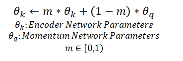

## Specific results
###Contrastive Predictive Coding (CPC)
Oord et al. 2018

2 encoders: for query and for keys, updated together end-to-end
### Memory bank
Memory bank is a dictionary with representation of all samples for each batch.

For each batch
* sample keys from the dictionary as negative samples
* compute contrastive loss, update encoder
* use representations of the batch to update corresponding values in the dictionary
with momentum update

Note: representations in the dictionary are inconsistent with current version of the encoder, 
but that's fine

### MoCo (Momentum Contrast)
MoCo is a mechanism for a large dynamic dictionary for negative samples

Specialties:
1. 2 encoders <br/>
   both of same architecture (ResNet50) and start with same weights
    1. encoder network N - for queries
    2. momentum encoder N' - for keys
2. dicitonary D of negative samples in a form of a queue
   


Training procedure
* sample batch X
* sample 2 augmentations tau, tau'
* tau(X) -> N -> queries; tau'(X) -> N' -> keys
* positive logits(queries, keys) = \+
* negative logits(queries, some values from D) = \-
* contrastive loss(+,-)
* update weights
    * of N using SGD
    * of N' using new weights of N
    
* update D
    * remove earliest batch
    * add current batch
    
Note:
```To ensure stability, a really high momentum value is chosen (typically m=0.999). 
Though the keys in the queue come from different encoder networks (as in memory banks), 
the difference between the encoders are small.
```

Note: 
```
MoCo Ablation Studies & Takeaways:
1. Batch Normalization Shuffling ensures that the batch statistics for the query and the positive key come from different sub-batches (ensuring that the sub-batch statistics don’t “leak information” to the query about the samples in the batch).
2.Larger dictionary sizes (K) & higher momentum values (m) lead to more robust models.
3. Bigger and wider networks (like ResNet-50 4x) outperform shallower networks.
```

### SimCLR
* \+
    * no special architecture
    * no memory back
* \-
    * need large batch size to get decent amountof negative samples

Only 1 encoder network f + a shallow projection head (2 layers) g:
* f gives representations used for downstream tasks
* g projects them into smaller latent space for contrastive learning

Training procedure
* sample batch X={x1..xN}
* sample 2 augmentations tau, tau' from Tau={crop,resize,flip, color distortions,Gaussian blur}
* Y = {y1..y_{2N}}, where y_{2i-1}=tau(x_i), y_{2i}=tau'(x_i)
* h_i = f(y_i), z_i = g(h_i)
* s_{i,j} = cos_sim(z_i,z_j) for i,j \in 1..2N <br/>
l_{i,j} = softmax of s_{i,j} <br/>
  L = \frac{1]{2N} \sum_{k=1}^{N} (l_{2k-1,2k} + l_{2k,2k-1})
    
* update weights with SGD


### MoCo v2
MoCo v2 = SimCLR + MoCo

was at CVPR20

TBD